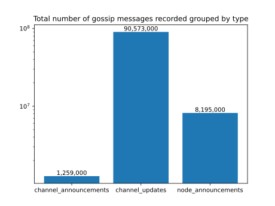

+++
title = "Lightning Network History"
description = "An open source project to unvail the Lightning Networks history."
+++

## ⚡️ Motivation
Since the beginning of Bitcoin on Janurary 3rd 2009, it has kept many of its promises and is establishing itself as a store-of-value solution.
Nonetheless Satoshi Nakamoto titled in the [Bitcoin Whitepaper](https://bitcoin.org/bitcoin.pdf) "Bitcoin: A Peer-to-Peer Electronic Cash System", emphesising on its use case as digital cash for peer to peer transactions. The Bitcoin blockchain, the leger that keeps track of every transaction, is limited in its scaleability. To keep the Bitcoin blockchain as decentralized as possible, any idea of directly scaling it by e. g. increasing the storage size per block, failed. 

With a constant rate of adoption, storing information on the Bitcoin blockchain is scarce. In 2024 transaction costs reached record highs, making it unaffordable for daily use.

The Lightning Network - a second layer solution on top of Bitcoin - deployed in 2018, promises lightning fast and cheap payments, ultimatly scaling the transaction volume of Bitcoin. 
The technology of the Bitcoin Lightning Network is defined in [BOLTS](https://github.com/lightning/bolts/tree/master).
Although more than seven years passed, there are open questions for research about the Bitcoin Lightning Network.

## 🏁 Goal 
The aim of this open source project is to build a platform for researchers as well as node runners to help understand the (changing) topology of the Bitcoin Lightning Network, making it more accessible. 

See the section ✨Results for the current state of the analysis.

We also build a backend that exposes an [API](api.ln-history.info) that can be accessed to do one owns analysis. See [here](https://github.com/FabianFelixKraus/LN-history) for the code behind the analysis.

## 📊 Data
The analyzed gossip messages come from [Christian Deckers](https://github.com/cdecker) [lnresearch](https://github.com/lnresearch/topology/tree/main) repository.

The total number of recorded gossip messages shows that we collected over 100 Million gossip messages.

We can see that the number of channel update messages has been changing a lot.

As the number of nodes in the Bitcoin Lightning Network rose, the number of node anouncement messages also rose.

## ✨ Results
Currently we have two objectives of our analysis of the Lightning Networks history.

1. Lightning Network metrics

To get an overall view of the topology we want to show different metrics of the topology at different timestamps.

2. Lightning Network vs Bitcoin Blockchain

We try to find correlations of the Bitcoin Lightning Network with the Bitcoin blockchain. More precisely, we research if the cost of a payment in the Lightning Network correlates with the fees on the Bitcoin blockchain. Those results could be particularly interesting for (routing) nodes that need to manage their liquidity as cost-efficient as possible.

## 💻 Api
See [here](https://api.ln-history.info) for the swagger documentation of our API. The backend code can be found on [GitHub](https://github.com/FabianFelixKraus/LN-history) or mirrored on my univerisities [GitLab](https://git.tu-berlin.de/lightning-network-analysis/ln-history)